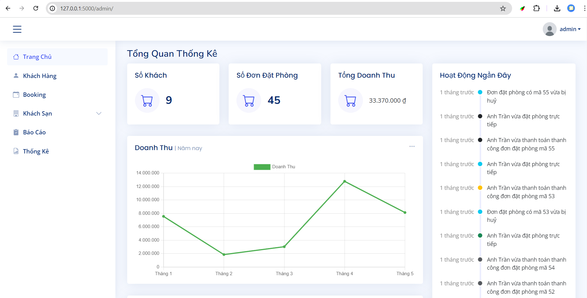
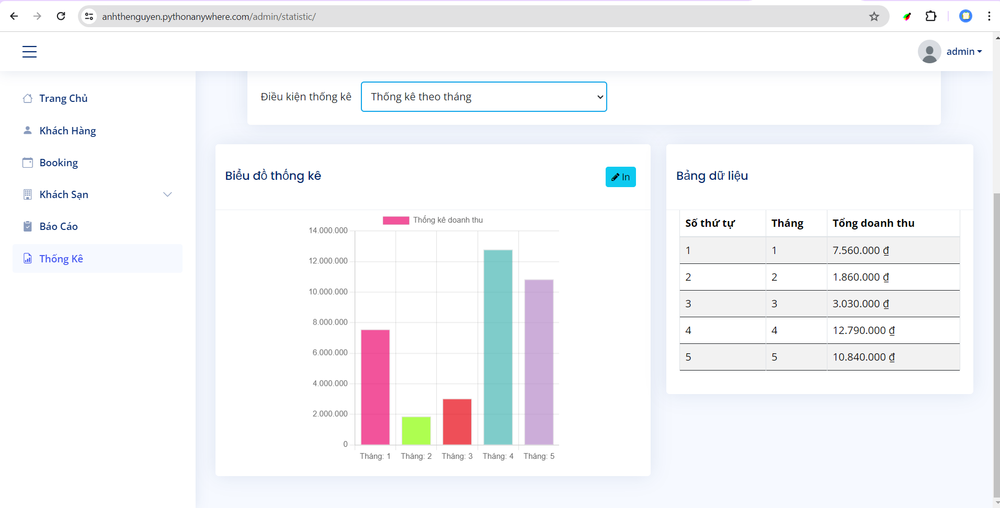
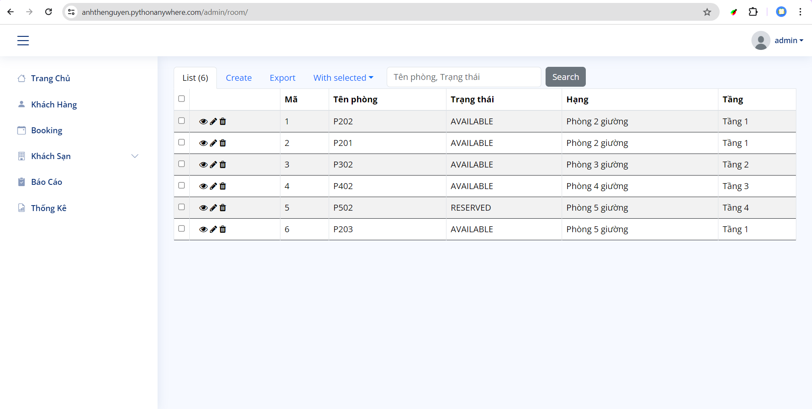
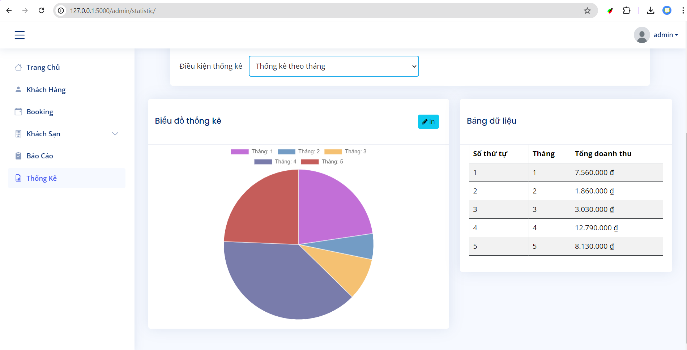
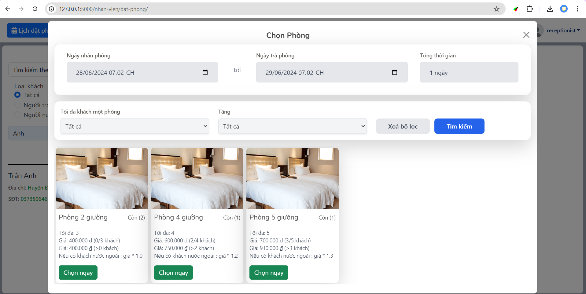
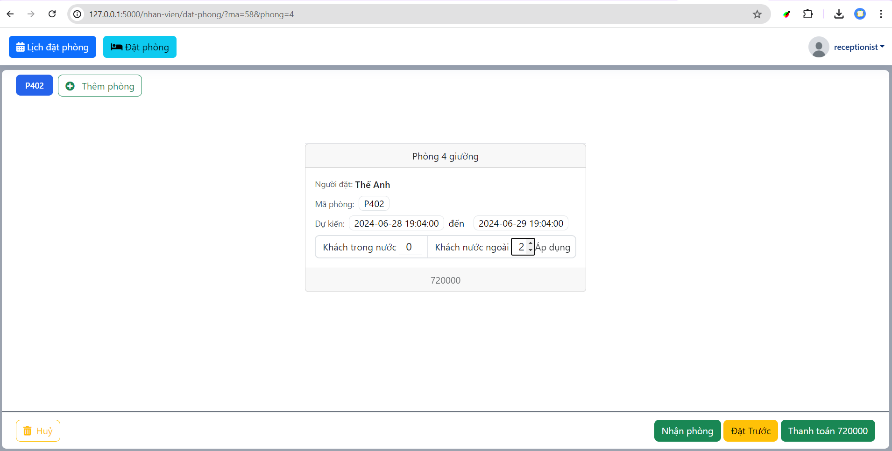
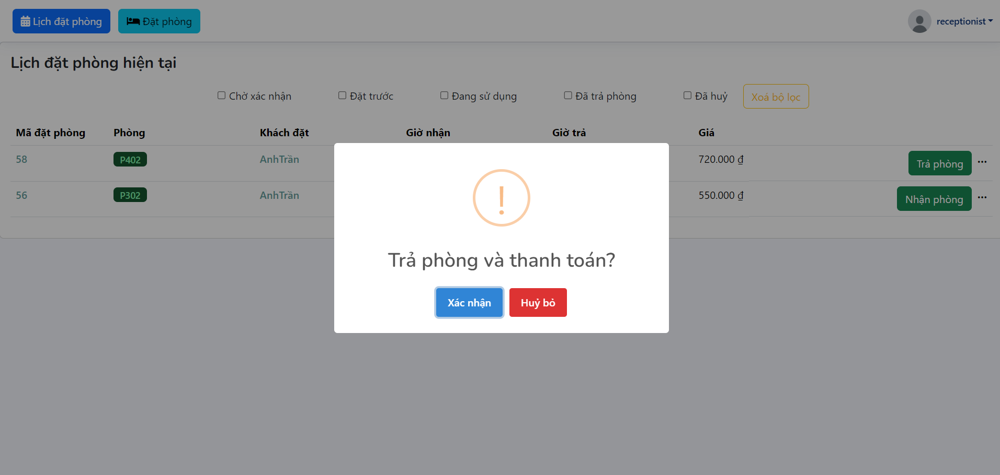
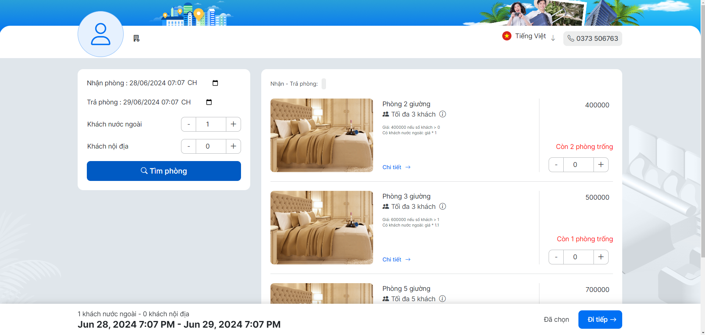
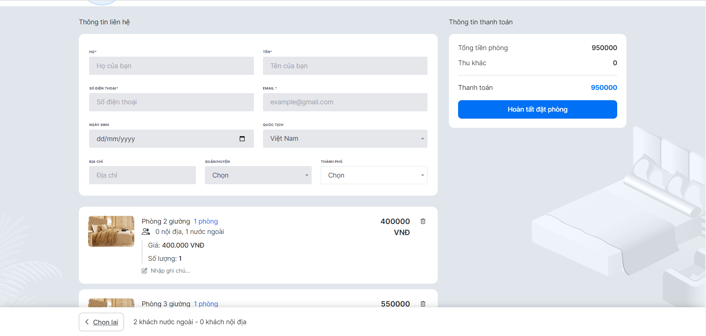

# Single Hotel Management System

Welcome to the Single Hotel Management System! This repository contains a comprehensive hotel management system designed to streamline the operations of a single hotel. It includes features for managing reservations, guests, rooms, and other essential hotel services.

## Table of contents

- 🗝️[Features](#features)
- 🛠️[Architecture](#architecture)
- 🏛️[Database schema](#database-schema-diagram)
- 🔷[Use case diagram](#use-case-diagram)
- 📷[Screenshots](#screenshots)
- 🔗[References](#🔗references)
- 📧[Contact](#📧contact)

## 🗝️Features

- **Room Management**: Add, update, and delete room details.
- **Reservation System**: Manage guest reservations with ease.
- **Guest Management**: Keep track of guest information and history.
- **Billing and Invoicing**: Generate bills and invoices for guests.
- **User Authentication**: Secure login and user roles.
- **Reporting**: Generate reports on various aspects of hotel operations.

## 🛠️Architecture

The Single Hotel Management System is designed using the Model-View-Controller (MVC) architecture, which separates the application into several components to promote organized and modular code.

- **Model**: Manages the data and business logic (e.g., database models).
- **View**: Handles the display of information (e.g., HTML templates).
- **Controller**: Processes user input and interacts with the model to render the final output (e.g., route handlers).
- **Service**: Contains the business logic, orchestrating between the controller and the repository.
- **Repository**: Manages data persistence and retrieval from the database.
- **Template**: HTML templates for rendering the user interface.

## 🏛️Database schema

## 🔷Use case diagram

## 📷 Screenshots

Here are some screenshots of the Single Hotel Management System in action:

### Admin

</img>
</img>
</img>
</img>

### Receptionist

</img>
</img>
</img>
</img>

### Guest

</img>
</img>

## 🔗References

Here are some helpful resources and references for further information:

- [Flask Documentation](https://flask.palletsprojects.com/en/3.0.x/)

## 📧Contact

Don't hesitate to contact me if you have any confusion or questions

<a href="#single-hotel-management-system" style="transition: all .25s ease-in-out; position: fixed; bottom: 0; right: 0; display: inline-flex; cursor: pointer; align-items: center; justify-content: center; margin: 0 2em 2em 0; padding: .25em; width: 8em; height: 2em;">
  🔼 Back to top
</a>
